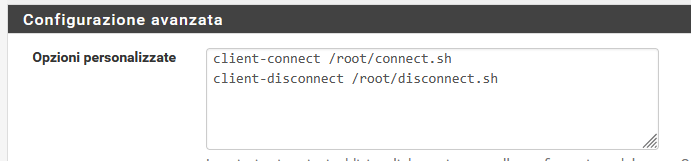

# pfsense_telegraf_openvpn_scripts

## log Openvpn connect and disconenct events on pfsense

Add scripts to openvpn settings

create the scripts with correct execution mode.

Telegrams messages received:

